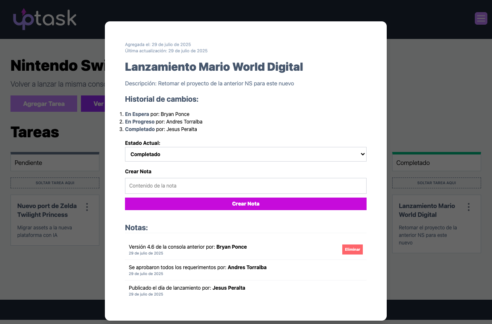

# FRONT MERN - REST API REACT/TypeScript
React Web Platform connected to an API hosted on a MongoDB + Express + React + Node ( MERN )




## Technologies
React + Typescript + TailwindCSS + Axios + Zod + React Router + React Query
## Developer Notes
## Deploy on Vercel
Website hosted on vercel.com server
https://client-uptask-node-typescript.vercel.app/
### Managed with Axios
#### src/lib/axios.ts
```
import axios from "axios"

const api = axios.create({
    baseURL: import.meta.env.VITE_API_URL
});

api.interceptors.request.use( config => {
  const token = localStorage.getItem('AUTH_TOKEN')
  if(token){
    config.headers.Authorization = `Bearer ${token}`
  }
  return config
})
export default api
```
#### src/api/ProjectAPI.ts
```
import api from "@/lib/axios";
import { dashboardProjectSchema, editProjectSchema, projectSchema, type Project, type ProjectFormData } from "../types";
import { isAxiosError } from "axios";

export async function createProject( formData : ProjectFormData ) {
    
    try {
        const { data } = await api.post( '/projects' , formData )
        return data        
    } catch (error) {
        if( isAxiosError(error) && error.response ){
            throw new Error(error.response.data.error)
        }
        
    }
    
}

export async function getProjects() {
    
    try {
        const { data } = await api('/projects')  
        const response = dashboardProjectSchema.safeParse(data)
        
        if(response.success) return response.data
        //return []; // O retorna un array vacío para evitar undefined
    } catch (error) {
        if( isAxiosError(error) && error.response){
            throw new Error( error.response.data.error )
        }
        return [];
    }
}

export async function getProjectsById( id : Project['_id'] ) {
    try {
        const { data } = await api(`/projects/${ id }`)
        const response = editProjectSchema.safeParse(data)
        if(response.success){
            return response.data
        }
    } catch (error) {
        if( isAxiosError(error) && error.response){
            throw new Error( error.response.data.error )
        }
    }
}

export async function getFullProject( id : Project['_id'] ) {
    try {
        const { data } = await api(`/projects/${ id }`)
        const response = projectSchema.safeParse(data)
        if(response.success){
            return response.data
        }
    } catch (error) {
        if( isAxiosError(error) && error.response){
            throw new Error( error.response.data.error )
        }
    }
}

type ProjectAPIType = {
    formData: ProjectFormData
    projectId: Project['_id']
}

export async function updateProject({ formData , projectId } : ProjectAPIType) {
    try {
        const { data } = await api.put<string>(`/projects/${ projectId }` , formData)
            return data            
    } catch (error) {
        if( isAxiosError(error) && error.response){
            throw new Error( error.response.data.error )
        }
    }
}

export async function deleteProject( id : Project['_id'] ) {
    try {
        const { data } = await api.delete<string>(`/projects/${ id }`)
            return data            
    } catch (error) {
        if( isAxiosError(error) && error.response){
            throw new Error( error.response.data.error )
        }
    }
}
```
#### src/types/index.ts
```
import { z } from "zod"

/** Auth & Users */

const authSchema = z.object({
    name: z.string(),
    email: z.email(),
    current_password: z.string(),
    password: z.string(),
    password_confirmation: z.string(),
    token: z.string()
})

type Auth = z.infer<typeof authSchema>
export type UserLoginForm = Pick<Auth, 'email' | 'password'>
export type UserRegistrationForm = Pick<Auth, 'name' | 'email' | 'password' | 'password_confirmation'>
export type RequestConfirmationCodeForm = Pick<Auth, 'email' >
export type ForgottenPasswordForm = Pick<Auth, 'email' >
export type NewPasswordForm = Pick<Auth, 'password' | 'password_confirmation' >
export type UpdateCurrentPasswordForm = Pick<Auth, 'password' | 'password_confirmation' | 'current_password'>
export type ConfirmToken = Pick<Auth, 'token'>
export type CheckPasswordForm = Pick<Auth, 'password'>

/** User Authentication */
export const userSchema = authSchema.pick({
    name:true,
    email:true
}).extend({
    _id: z.string()
})
export type User = z.infer<typeof userSchema>
export type UserProfileForm = Pick<User, 'name' | 'email'>

/** Notes */
const noteSchema = z.object({
    _id: z.string(),
    content: z.string(),
    createdBy: userSchema,
    task: z.string(),
    createdAt: z.string()
})
export type Note = z.infer<typeof noteSchema>
export type NoteFormData = Pick<Note, 'content'>

/** Tasks */
export const taskStatusSchema = z.enum(["pending", "onHold" , "inProgress" , "underReview" , "completed"])
export type TaskStatus = z.infer<typeof taskStatusSchema>

export const taskSchema = z.object({
    _id: z.string(),
    name: z.string(),
    description: z.string(),
    project: z.string(),
    status: taskStatusSchema,
    completedBy: z.array(z.object({
        _id: z.string(),
        user: userSchema,
        status: taskStatusSchema
    })),
    notes: z.array(noteSchema.extend({
        createdBy: userSchema
    })),
    createdAt: z.string(),
    updatedAt: z.string()
})

export const taskProjectSchema = taskSchema.pick({
    _id: true,
    name: true,
    description: true,
    status: true
})

export type Task = z.infer<typeof taskSchema>
export type TaskFormData = Pick<Task, 'name' | 'description'>
export type TaskProject = z.infer<typeof taskProjectSchema>

/** Projects **/
export const projectSchema = z.object({
    _id: z.string(),
    projectName: z.string(),
    clientName: z.string(),
    description: z.string(),
    manager: z.string(),
    tasks: z.array( taskProjectSchema ),
    team: z.array( z.string() )
})

export const dashboardProjectSchema = z.array(
   projectSchema.pick({
        _id: true,
        projectName: true,
        clientName: true,
        description: true,
        manager: true,
        tasks: true,
        team: true
   })
)

export const editProjectSchema = projectSchema.pick({
    projectName: true,
    clientName: true,
    description: true
})

export type Project = z.infer<typeof projectSchema>
export type ProjectFormData = Pick<Project , 'clientName' | 'projectName' | 'description' > & { tasks?:string[] }


/** Team */
const teamMemberSchema = userSchema.pick({
    name: true,
    email: true,
    _id:true
})

export const teamMembersSchema = z.array(teamMemberSchema)
export type TeamMember = z.infer<typeof teamMemberSchema>
export type TeamMemberForm = Pick<TeamMember , 'email'>
```
#### src/env.local
```
VITE_API_URL=https://server-uptask-node-typescript.onrender.com/api
```
