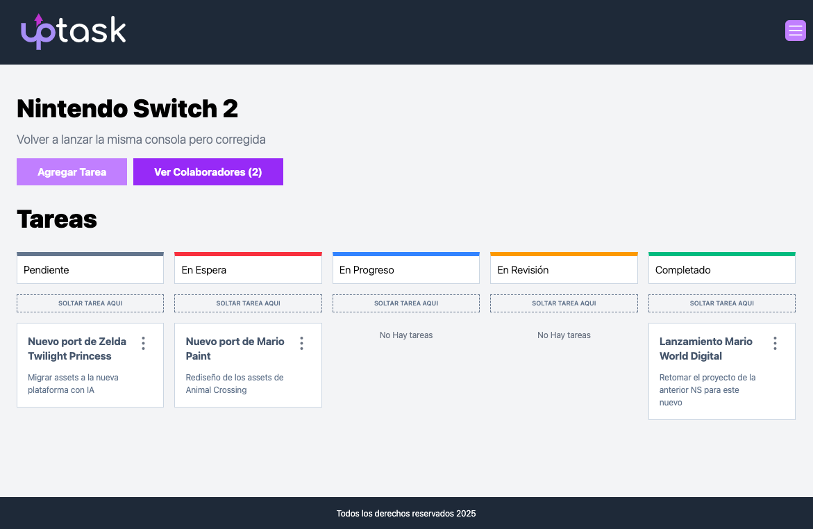

# FRONT MERN - REST API REACT/TypeScript
React Web Platform connected to an API hosted on a MongoDB + Express + React + Node ( MERN )


## Technologies
React + Typescript + TailwindCSS + Axios + Zod + React Router + React Query
## Developer Notes
### Managed with Axios
#### src/lib/axios.ts
```
import axios from "axios"

const api = axios.create({
    baseURL: import.meta.env.VITE_API_URL
})

export default api
```
#### src/api/ProjectAPI.ts
```

import api from "@/lib/axios";
import { dashboardProjectSchema, type Project, type ProjectFormData } from "../types";
import { isAxiosError } from "axios";

export async function createProject( formData : ProjectFormData ) {
    
    try {
        const { data } = await api.post( '/projects' , formData )
        return data        
    } catch (error) {
        if( isAxiosError(error) && error.response ){
            throw new Error(error.response.data.error)
        }
        
    }
    
}

export async function getProjects() {
    try {
        const { data } = await api('/projects')        
        const response = dashboardProjectSchema.safeParse(data)
        console.log({response});
        
        if(response.success) return response.data        
    } catch (error) {
        if( isAxiosError(error) && error.response){
            throw new Error( error.response.data.error )
        }
    }
}

export async function getProjectsById( id : Project['_id'] ) {
    try {
        const { data } = await api(`/projects/${ id }`)
            return data            
    } catch (error) {
        if( isAxiosError(error) && error.response){
            throw new Error( error.response.data.error )
        }
    }
}

type ProjectAPIType = {
    formData: ProjectFormData
    projectId: Project['_id']
}

export async function updateProject({ formData , projectId } : ProjectAPIType) {
    try {
        const { data } = await api.put<string>(`/projects/${ projectId }` , formData)
            return data            
    } catch (error) {
        if( isAxiosError(error) && error.response){
            throw new Error( error.response.data.error )
        }
    }
}

export async function deleteProject( id : Project['_id'] ) {
    try {
        const { data } = await api.delete<string>(`/projects/${ id }`)
            return data            
    } catch (error) {
        if( isAxiosError(error) && error.response){
            throw new Error( error.response.data.error )
        }
    }
}
```
#### src/types/index.ts
```
import { z } from "zod"

/** Tasks */
export const taskStatusSchema = z.enum(["pending", "onHold" , "inProgress" , "underReview" , "completed"])
export type TaskStatus = z.infer<typeof taskStatusSchema>

export const taskSchema = z.object({
    _id: z.string(),
    name: z.string(),
    description: z.string(),
    project: z.string(),
    status: taskStatusSchema,
    createdAt: z.string(),
    updatedAt: z.string()
})

export type Task = z.infer<typeof taskSchema>
export type TaskFormData = Pick<Task, 'name' | 'description'>

/** Projects **/
export const projectSchema = z.object({
    _id: z.string(),
    projectName: z.string(),
    clientName: z.string(),
    description: z.string(),
    tasks: z.array( z.object() )
})

export const dashboardProjectSchema = z.array(
   projectSchema.pick({
        _id: true,
        projectName: true,
        clientName: true,
        description: true,
        tasks: true
   })
)

export type Project = z.infer<typeof projectSchema>
export type ProjectFormData = Pick<Project , 'clientName' | 'projectName' | 'description' | 'tasks' >
```
